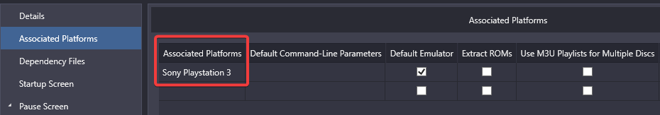

# 🎮 RPCS3-ISOLauncher-Launchbox

A PowerShell script to mount a PlayStation 3 ISO image for use with the [RPCS3](https://rpcs3.net) emulator, designed for seamless integration with [LaunchBox](https://www.launchbox-app.com). The script automatically mounts the ISO, launches the game in RPCS3, and unmounts the ISO when RPCS3 closes. All actions and errors are logged for troubleshooting.

## ✨ Features

- ✅ **Automatic ISO Mounting:** Mounts the specified ISO and detects the drive letter.
- ✅ **Automatic Unmount:** Dismounts the ISO after RPCS3 closes.
- 📝 **Robust Logging:** All actions and errors are appended to a log file with timestamps.
- 🛡️ **Error Handling:** Validates ISO path, checks for EBOOT.BIN, and handles failures gracefully.

## ⚡ Installation

1. 📄 Copy [`RPCS3-ISO-LaunchBox.ps1`](./RPCS3-ISO-LaunchBox.ps1) to the same folder as `rpcs3.exe`.
    - If you prefer a different location, edit the `$RPCS3path` variable in the script to point to your `rpcs3.exe`.
    ```powershell
    $RPCS3path = "$PSScriptRoot\rpcs3.exe"  # Default: same folder as script
    # or
    $RPCS3path = "D:\Path\To\rpcs3.exe"    # Custom path
    ```

2. 🛠️ Configure LaunchBox:
    - Open **Tools → Manage → Emulators...**
    - Add a new Emulator and configure like:

      
    - Set the emulator application path to your PowerShell executable (e.g., `pwsh.exe` for PowerShell 7 or `powershell.exe` for Windows PowerShell).
    - ⚠️ **Note:** PowerShell 7 is not installed by default on Windows. You can download it from [Microsoft's official site](https://github.com/PowerShell/PowerShell).
    - Example PowerShell 7 path:
      ```
      C:\Program Files\PowerShell\7\pwsh.exe
      ```
    - Example Windows PowerShell path:
      ```
      C:\Windows\System32\WindowsPowerShell\v1.0\powershell.exe
      ```
    - Set the default command-line parameters:
      ```powershell
      -noprofile -executionpolicy bypass -WindowStyle hidden -file "<PathToScript>\RPCS3-ISO-LaunchBox.ps1" -ISOpath "%romfile%"
      ```
      Replace `<PathToScript>` with the actual path to your script which should be inside the RPCS3 folder if you are following this guide and did not change it.

3. 🎮 Also configure an association with PlayStation 3 and set as default if desired.
   - 

## 🚀 Usage

- ▶️ If you set as default, launch game normally from LaunchBox.
- 🖱️ If not default, right-click a game and choose **Launch with...** and pick the emulator you created above.

- To run manually from PowerShell (without LaunchBox):
  ```powershell
  cd C:\path\to\rpcs3folder
  .\RPCS3-ISO-LaunchBox.ps1 -ISOpath D:\path\to\game.iso
  ```
- The script will:
  1. 🔍 Validate the ISO path.
  2. 💽 Mount the ISO and detect the drive letter.
  3. 📂 Locate `EBOOT.BIN` at `DriveLetter:\PS3_GAME\USRDIR\EBOOT.BIN`.
  4. 🕹️ Launch RPCS3 in Fullscreen, NoGui mode. (Hit `Esc` to minimize.)
  5. ⏳ Wait for RPCS3 to exit, then unmount the ISO.
  6. 📝 Log all actions and errors to a file.

## 📝 Logging

- All actions and errors are logged to the same folder as the script in a file called `pwsh.log`.
- Each entry includes a timestamp and message.
- The log file is appended (not overwritten) on each run.

## 🛠️ Troubleshooting

- ❌ **ISO not mounting or no drive letter assigned:**
  - Ensure the ISO file exists and is not corrupted or encrypted.
  - The script waits up to 10 seconds for the drive to be ready.
- ❌ **EBOOT.BIN not found:**
  - The script expects the standard PS3 folder structure. Custom ISOs may not work.

## 📦 Bulk Decrypting PS3 ISOs

The [`Bulk-Decrypt-ISOs.ps1`](./Bulk-Decrypt-ISOs.ps1) script allows you to decrypt multiple PS3 ISO files in a batch process using `ps3dec.exe` and your collection of `.dkey` files.

### Usage

1. **Download** [`Bulk-Decrypt-ISOs.ps1`](./Bulk-Decrypt-ISOs.ps1) and save it to a folder of your choice. **Edit the script** to set the correct paths at the top for:
   - `$PS3DEC` – Path to your `ps3dec.exe` binary
   - `$ISOroot` – Folder containing your encrypted ISO files
   - `$ISOdecrypt` – Folder where decrypted ISOs will be moved
   - `$dKeys` – Folder containing your `.dkey` files (named to match each ISO)

2. **Run the script** from PowerShell:
   ```powershell
   cd D:\downloads
   .\Bulk-Decrypt-ISOs.ps1
   ```

3. The script will:
   - Scan the ISO folder for all files
   - Find the matching `.dkey` for each ISO
   - Run `ps3dec.exe` to decrypt each ISO
   - Move decrypted ISOs to the target folder
   - Output a summary report with status, file size, regions, and any errors

### Output
- Output is parsed from ps3dec
- The script prints a table of results to the console.
- Each entry includes the original ISO name, decrypted file, status, and details from the decryption process.
- Errors (such as missing keys or decryption failures) are reported per file.

---

